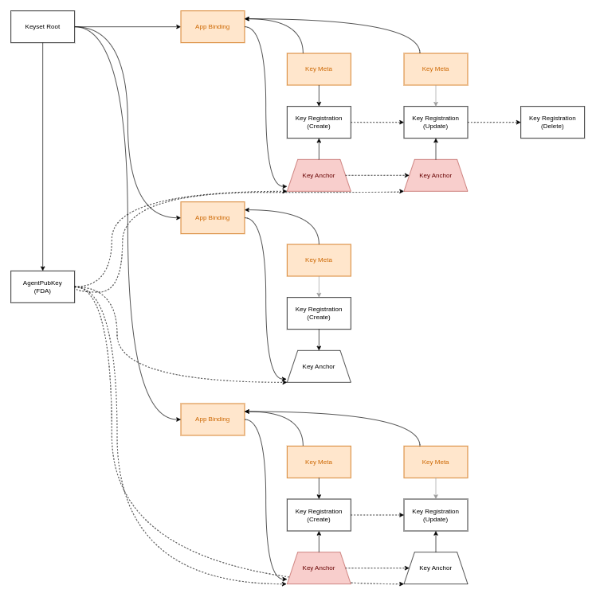

[back to README.md](README.md)


# Contributing

The purpose of this repo is to build a Holochain DNA that provides a decentralized public key
infrastructure (DPKI) that will be the default for Holochain installations.


## Overview
The Deepkey DNA is designed so that it can work on its own, but architectural decisions are driven
by the necessary integrations required to support Holochain's DPKI service and Lair.

In the design space of all possible Deepkey implementations, any type of public key could be
registered and managed (eg. for blockchains, TLS certificates, etc).  This implementation only
supports the registration of Holochain `AgentPubKey`.


### Entity Relationship Diagram (high-level)




## Development

### Environment

- Enter `nix develop` for development environment dependencies.

### Documentation

```bash
make docs

# or, build individual packages
make target/doc/deepkey_types/index.html
make target/doc/deepkey_sdk/index.html
make target/doc/deepkey/index.html
make target/doc/deepkey_csr/index.html
```

See [deepkey_csr/index.html](https://holochain.github.io/deepkey/deepkey_csr/index.html) for
detailed API References.

### Building

#### DNA Bundle

```bash
make dna/deepkey.dna
```

#### [Deepkey types crate](https://crates.io/crates/hc_deepkey_types)

Build package without publishing
```bash
make preview-deepkey-types-crate
```

Publish package
```bash
make publish-deepkey-types-crate
```

#### [Deepkey SDK crate](https://crates.io/crates/hc_deepkey_sdk)

Build package without publishing
```bash
make preview-deepkey-sdk-crate
```

Publish package
```bash
make publish-deepkey-sdk-crate
```


### Testing

To run all tests with logging
```
make test
```

- `make test-unit` - **Rust tests only**
- `make test-integration` - **Integration tests only**

#### Integration tests

- `make test-basic` - Test MVP features
- `make test-change-rules` - Test management of change rules
- `make test-key-management` - Test management of key evolution
- `make test-claim-unmanaged-key` - Test ability to handle multiple claims of the same key


> **NOTE:** set DEBUG_LEVEL environment variable to run tests with logging (options: fatal, error,
> warn, normal, info, debug, trace)
>
> Example
> ```
> DEBUG_LEVEL=trace make test
> ```


### Prospective features

#### Limbo
Features that were planned but may no longer be implemented.

- [Multi-device Management](./docs/limbo/Multi_device_management.md)


#### Prototype
Features that are planned but may or may not be completed.

- [Generators](./docs/prototype/Generators.md)
- [Membrane Proof](./docs/prototype/Membrane_proof.md)

##### Feature "Claim keys"
`KeyRegistration::CreateOnly` serves the temporary purpose of allowing Holo Hosts to register keys
of web users without being able to manage those keys. This feature could be replaced with adding a
claim key for web users to claim their unmanaged keys if/when they become a self-hosted Holochain
user.
